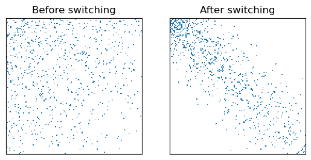

### Degree-preserving switching (rewiring) in graphs

##### NetSwitch Class can be initialized by a graph (now implemented to take an igraph network).
The example below, generates a random (Erdos-Renyi) network and performs a specified number of "assortative switchings" on it.


```python
import random
import numpy as np
import igraph as ig
import matplotlib.pyplot as plt
from matplotlib import colors
from NetSwitchAlgs import NetSwitch

# Initializing NetSwitch  with an ER network
random.seed(0)
n = 128
p = 0.05
ERgraph = ig.Graph.Erdos_Renyi(n=n, p=p)
S = NetSwitch(ERgraph)

# Plotting the initial adjacency matrix
plt.figure()
cmap = colors.ListedColormap(['white', 'tab:blue'])
plt.subplot(1, 2, 1)
plt.title('Before switching')
plt.imshow(S.A, cmap=cmap)
plt.xticks([])
plt.yticks([])

# Switching the networkby specifying the algorithm and switch count: 500 randomly selected degree-preserving assortative switchings
S.switch_A(alg='RAND', count=500)

# Plotting the switched adjacency matrix
plt.subplot(1, 2, 2)
plt.title('After switching')
plt.imshow(S.A, cmap=cmap)
plt.xticks([])
plt.yticks([])

plt.show()
```


    

    

